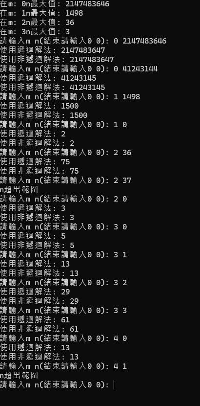

# 作業1: 阿克曼函式(Ackermann Function)

### 題目定義
---

$$Ack(m, n)=\begin{cases}
    n + 1 &\text{if } m=0 \\
    Ack(m-1,\space 1) &\text{if } n=0 \\
    Ack(m-1, \space Ack(m, \space n - 1)) &\text {else}
\end{cases}$$
### 解題說明
---
- 使用遞迴解來解決此問題
- 使用非遞迴解來解決此問題

---
#### 1. 使用遞迴解

##### 建立一函式 
> int Ack(int m, int n);

##### 如果m = 0
> return n + 1
##### 如果 m > 0 and n = 0
> return Ack(m - 1, 1)
##### 如果 m > 0 and n > 0
> return Ack(m - 1, Ack(m, n - 1))

---
#### 2. 使用非遞迴解
##### 函式規則如下

$$\begin{cases}
    n + 1 &\text{if } m=0 \\
    n + 2 &\text{if } m=1 \\
    2 \cdot (n + 3) - 3 &\text{if } m=2 \\
    \tag{hi} 2^{(n+3)}-3 &\text{if } m=3 \\
    65533 &\text{if } (m=3 & n=0)
\end{cases}$$

- 來源:[維基百科](https://zh.wikipedia.org/zh-tw/%E9%98%BF%E5%85%8B%E6%9B%BC%E5%87%BD%E6%95%B8)


##### 利用switch可以實現此函式

```c++
switch (m)
        {
        case 0:
            cout << n + 1 << endl;
            break;
        case 1:
            cout << n + 2 << endl;
            break;
        case 2:
            cout << 2 * (n + 3) - 3 << endl;
            break;
        case 3:
            cout << static_cast<long long>(pow(2, n + 3)) - 3 << endl;
            break;
        case 4:
            if (n == 0)
                cout << 13 << endl;
            else if (n == 1)
                cout << 65533 << endl;
            break;
        default:
            break;
        }
```

### 效能分析
#### 1.遞迴
---
##### 當 m = 0，只須回傳n + 1
##### <center>時間複雜度: O(1)<center>
##### <center>空間複雜度: O(1)<center>

---

##### 當 m = 1，需遞迴Ack(0, Ack(1, n - 1))，需要重複計算直到n = 0，過程中需要執行n + 1次

##### <center>時間複雜度: O(n)<center>
##### <center>空間複雜度: O(n)<center>

---

##### 當 m = 2，需遞迴Ack(1, Ack(2, n - 1))，而需要找到n = 1所有可能，過程中需要執行2 x n + 3次
##### <center>時間複雜度: O(n)<center>
##### <center>空間複雜度: O(n)<center>

---

##### 當 m = 3，需遞迴Ack(2, Ack(3, n - 1))，時間複雜度將隨n的大小成指數增加
##### <center>時間複雜度: $O(n^2) $<center>
##### <center>空間複雜度: $O(n^2) $<center>

---

##### 當m = 4，時間複雜度為不斷 ^ 2 直到n - 1次 n ^ 2 ^ 2....
##### <center>時間複雜度: $O(2^{2^n}) $<center>
##### <center>空間複雜度: $O(2^{2^n}) $<center>

---

#### 2.非遞迴
##### 因為只需知道m及n就可得知結果，並且不須陣列儲存計算結果
##### 因為只需知道m及n就可得知結果，並且不須陣列儲存計算結果
##### <center>時間複雜度: O(1)<center>
##### <center>空間複雜度: O(1)<center>

### 測試與驗證

##### 測試輸入:
```
0 2147483646
0 41243144
1 1498
1 0
2 36
2 37
2 0
3 0
3 1
3 2
3 3
4 0
4 1
```
##### 測試輸出
```
2147483647
41243145
1500
1
75
n超出範圍
3
5
13
29
6
1
13
n超出範圍
```


### 申論及心得

#### 在寫阿克曼函式的時候需要注意當遞迴超過記憶體堆疊上限的時候會引發堆疊錯誤，所以我在code的地方有加入堆疊最大值，當當前堆疊數超過5000時會直接return -1，避免堆疊過深引發錯誤，另外當m = 4 n = 1時數字就會到天文數字了，所以極限值是m = 4, n = 1

#### 另外有在摸索的為記憶化(Memoization)，計算過後的值記憶，如果用正常的陣列實現的話當n值過大時會引發超出索引的錯誤，後來想到可以利用key value的方式來儲存，有機會的話在實現


By. 41243144