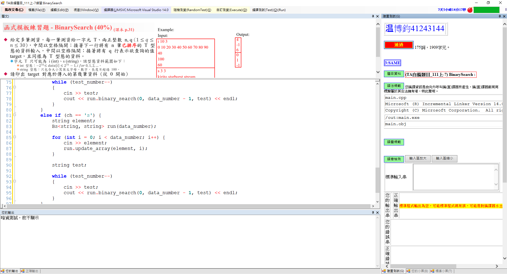

# 題目: 二分搜

### 題目定義
---

#### 利用c++樣板寫出字串或數字二分搜類別

### 解題說明
---
1. 判斷輸入是整數或字串
2. 建立類別並將資料丟入
3. 二搜使用遞迴解來找出目標值


---
#### 程式碼


```c++
#include <iostream>
#include <string>

using namespace std;


// 建立樣板
template<class T1, class T2>


// class 
class Bs {
private:
    // 定義陣列arr
    T1 *arr;

public:
    // 建構子
    Bs(int length) {
        // 初始化陣列
        this->arr = new T1[length];
    }
    // 解構子
    ~Bs() {
        delete[] arr;
    }

    // 傳遞參數
    void update_array(T1 element, int index) {
        arr[index] = element;
    }

    // 二分搜
    int binary_search(int left, int right, T2 target) {
        // cout << left << " " << right << " " << target << endl;

        // 找不到回傳-1
        if (left > right) return -1;
        int mid = (left + right) / 2;

        if (arr[mid] == target) {
            return mid;
        }

        else if(arr[mid] < target) {
            return binary_search(mid + 1, right, target);
        }
        else {
            return binary_search(left, mid - 1, target);
        }
    }
};


int main()
{
    char ch;
    int data_number, test_number;
    while (cin >> ch) {
        cin >> data_number >> test_number;

        if (ch == 'i') {

            int element;
            Bs<int, int> run(data_number);

            for (int i = 0; i < data_number; i++) {
                cin >> element;
                run.update_array(element, i);
            }

            int test;

            while (test_number--)
            {
                cin >> test;
                cout << run.binary_search(0, data_number - 1, test) << endl;
            }
        }
        else if (ch == 's') {
            string element;
            Bs<string, string> run(data_number);

            for (int i = 0; i < data_number; i++) {
                cin >> element;
                run.update_array(element, i);
            }

            string test;

            while (test_number--)
            {
                cin >> test;
                cout << run.binary_search(0, data_number - 1, test) << endl;
            }
        }
        cout << endl;
    }
}

```

### 效能分析
##### <center>二分搜時間複雜度: O(log n)<center>
##### <center>二分搜空間複雜度: O(log n)<center>
### 測試與驗證

##### 測試輸入:
```
i 10 3
0 10 20 30 40 50 60 70 80 90
40
100
60
s 3 3
kirito starburst stream
kirito
starburst
C8763

```
##### 測試輸出
```
4↵
-1
6

0
1
-1

```

### 申論及心得

#### 樣本可以將一個函式分成多個不同資料形態處理，是一個非常好用的工具，我在讀取輸入的部分，根據使用者輸入將資料傳到類別裡面，這樣做感覺會造成時間會花比較久，我想這是我可以改進的地方


By. wenwen