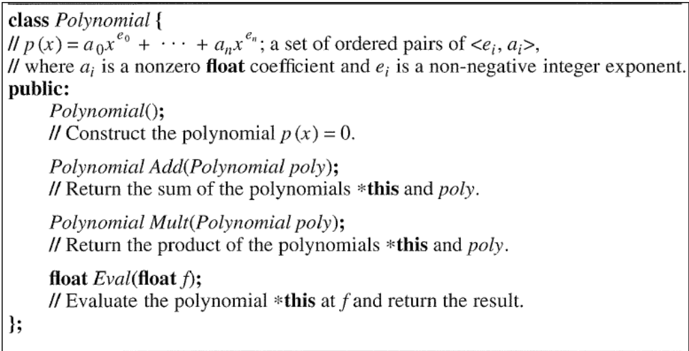
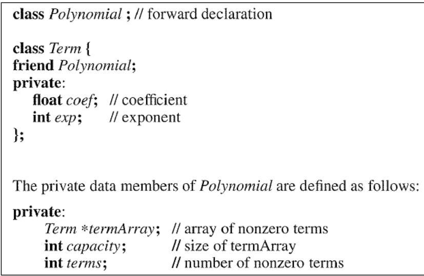
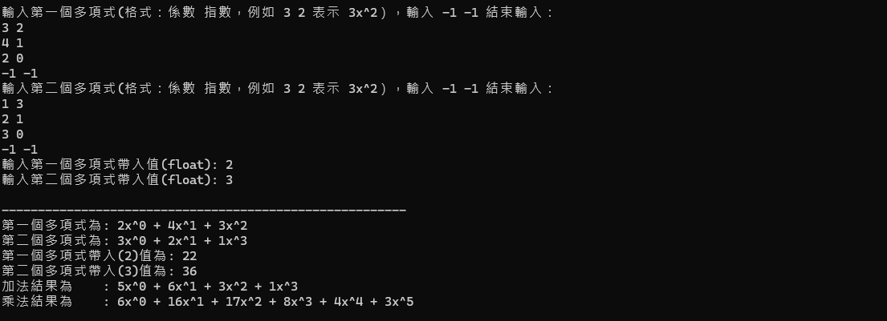
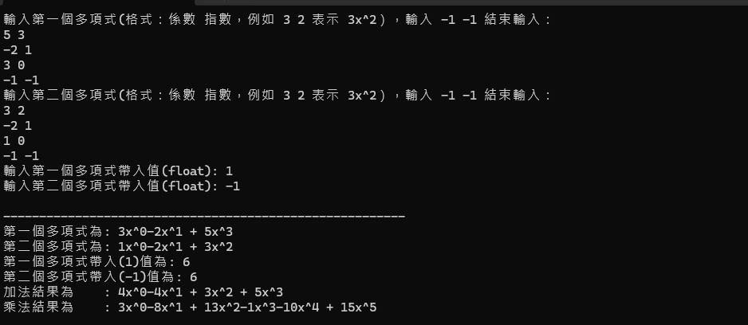

# 作業2: 多項式函數(Polynomial)

### 題目定義
---



### 解題說明
---

##### 1. 多項式的內容利用`Term`物件儲存
```c++
class Term {
    friend class Polynomial;
    friend istream& operator>>(istream& is, Polynomial& poly);
    friend ostream& operator<<(ostream& os, const Polynomial& poly);

private:
    float coef; // 多項式係數
    int exp;    // x的幾次方
};
```

##### 2. 多項式的`private`定義
```c++
private:
    Term* termArray;    // 多項式陣列指標
    int capacity;       // 當前陣列大小
    int terms;          // 當前使用到陣列長度
```

##### 3. 多項式的建構子，初始化陣列長度為1，而多項式初始化為 $0x^0$
```c++
public:
    Polynomial() {
        // 初始化類別物件
        termArray = new Term[1];
        termArray[0].exp = 0;
        termArray[0].coef = 0;
        capacity = 1;
        terms = 0;
    }
```

##### 4. `operator overloading >> ` 用`friend`朋友函式
```c++
    friend istream& operator>>(istream& input, Polynomial& poly) {
        /**
         *  運算子多載 >>， 輸入多項式直到讀取到-1 -1結束
         */
        float coef;
        int exp;
        while (true) {
            input >> coef >> exp;
            if (coef == -1 && exp == -1) break;
            poly.addTerm(coef, exp);
        }
        return input;
    }
```

##### 5. 將讀取資料儲存在成員中，若長度超過目前最大長度則擴充陣列長度
```c++
void addTerm(float coef, int exp) {
        /**
         *  將資料儲存，若當前資料大於陣列長度時呼叫 addArray()擴充陣列之後再儲存
         *
         *  args:
         *      - coef: 多項式係數
         *      - exp:  x的幾次方
         */

        if (terms + 1 >= capacity) {
            addArray();
        }

        int left = 0, right = terms - 1;

        while (left <= right) {
            int mid = left + (right - left) / 2;
            if (termArray[mid].exp == exp) {
                termArray[mid].coef += coef;
                return;
            }
            else if (termArray[mid].exp < exp) {
                left = mid + 1;
            }
            else {
                right = mid - 1;
            }
        }
        for (int i = terms; i > left; --i) {
            termArray[i] = termArray[i - 1];
        }
        termArray[left].coef = coef;
        termArray[left].exp = exp;
        terms++;
    }

    void addArray() {
        /**
         * 擴建陣列，每次大小*2，並將原有資料轉移至新的陣列
         */

        Term* newArray = new Term[capacity * 2];

        copy(termArray, termArray + terms, newArray);
        capacity *= 2;
        delete[] termArray;
        termArray = newArray;
    }
```

##### 6. 實作加法，建立一個空的多項式物件，然後根據自己以及輸入的多項式長度將相加結果儲存在新的物件中，若其中一個已經沒有元素了，則將另一個多項式剩下元素直接加進新物件中，最後返回
```c++
Polynomial Add(Polynomial poly) {
        /**
         *  將自己的多項式輸入的多項式做加法之後回傳
         *  args:
         *      - poly: 多項式被加數
         *
         *  retrun:
         *      Pllynomial: 加完後結果
         */

        Polynomial result;
        int thisCount = 0, polyCount = 0;
        result.capacity = this->capacity + poly.capacity;
        result.addArray();

        while (thisCount < this->terms && polyCount < poly.terms) {
            if (this->termArray[thisCount].exp == poly.termArray[polyCount].exp) {
                result.addTerm(this->termArray[thisCount].coef + poly.termArray[polyCount].coef, this->termArray[thisCount].exp);
                thisCount++;
                polyCount++;
            }
            else if (this->termArray[thisCount].exp > poly.termArray[polyCount].exp) {
                result.addTerm(this->termArray[thisCount].coef, this->termArray[thisCount].exp);
                thisCount++;
            }
            else {
                result.addTerm(poly.termArray[polyCount].coef, poly.termArray[polyCount].exp);
                polyCount++;
            }
        }

        while (thisCount < this->terms) {
            result.addTerm(this->termArray[thisCount].coef, this->termArray[thisCount].exp);
            thisCount++;
        }
        while (polyCount < poly.terms) {
            result.addTerm(poly.termArray[polyCount].coef, poly.termArray[polyCount].exp);
            polyCount++;
        }

        return result;
    }
```

##### 7. 實作乘法，將自己跟輸入多項式用兩個`for`迴圈組合後放入新的物件中並返回
```c++
Polynomial Mult(Polynomial poly) {
        /**
         *  將自己的多項式輸入的多項式做乘法之後回傳
         *  args:
         *      - poly: 多項式被乘數
         *
         *  retrun:
         *      Pllynomial: 乘完後結果
         */

        Polynomial result;
        for (int i = 0; i < this->terms; i++) {
            for (int j = 0; j < poly.terms; j++) {
                float newCoef = this->termArray[i].coef * poly.termArray[j].coef;
                int newExp = this->termArray[i].exp + poly.termArray[j].exp;
                result.addTerm(newCoef, newExp);
            }
        }
        return result;
    }
```

##### 8. 實作`Eval`，將使用者輸入的數字代入多項式後返回多項式代入後的解
```c++
float Eval(float f) {
        /**
         *  帶入一個數，回傳多項式的解
         *
         *  args:
         *      -f: 代入值
         *  return:
         *      float: 多項式代入f後的解
         */
        float result = 0;
        for (int i = 0; i < terms; i++) {
            result += termArray[i].coef * pow(f, termArray[i].exp);
        }
        return result;
    }
```

##### 9. `operator overloading <<`，輸出多項式
```c++
friend ostream& operator<<(ostream& out, const Polynomial& poly) {
        /**
         *  運算子多載 <<， 輸出多項式
         */
        for (int i = 0; i < poly.terms; i++) {
            if (i > 0 && poly.termArray[i].coef > 0)
                out << " + ";
            out << poly.termArray[i].coef << "x^" << poly.termArray[i].exp;
        }
        return out;
    }
```

---


### 效能分析
#### 1. 輸入: 對於每個多項式而言，輸入會擴展陣列，擴展陣列每次時間複雜度約為O(1)，而空間最小為O(n)

#### 2. 多項式加法: 因為需要把兩個多項式相加，所需用到時間複雜度為O(m + n) m n代表第一個多項式及第二個多項式，空間複雜度則為O(max(m, n))

#### 3. 多項式乘法: 因為需要把兩個多項式相乘，需要用到兩層`for`迴圈，所需用到時間複雜度為O(m * n) m n代表第一個多項式及第二個多項式，空間複雜度則為O(m * n)

#### 4. 多項式代入: 需要把數字代入多項式並返回，時間複雜度為O(n)，空間複雜度也為O(n)

#### 5. 多項式輸出: 時間複雜度O(n)，空間複雜度O(n)


---
##### 當 m = 0，只須回傳n + 1
##### <center>時間複雜度: O(1)<center>
##### <center>空間複雜度: O(1)<center>


### 測試與驗證

##### 測試:





### 申論及心得

#### 在實作多項式的時效考慮蠻多因數的，像是在儲存的時候會依照次方大小排序是因為之後再處理的時候會比較方便，不在做而外的排序，還有在實作運算子多載的時候會碰到無法儲存Term成員的問題，後來我是將Term 理新增friend就可以了

#### 在加法和乘法的部分我覺得也可以用運算子多載來取代，應該會比較好


By. 41243144